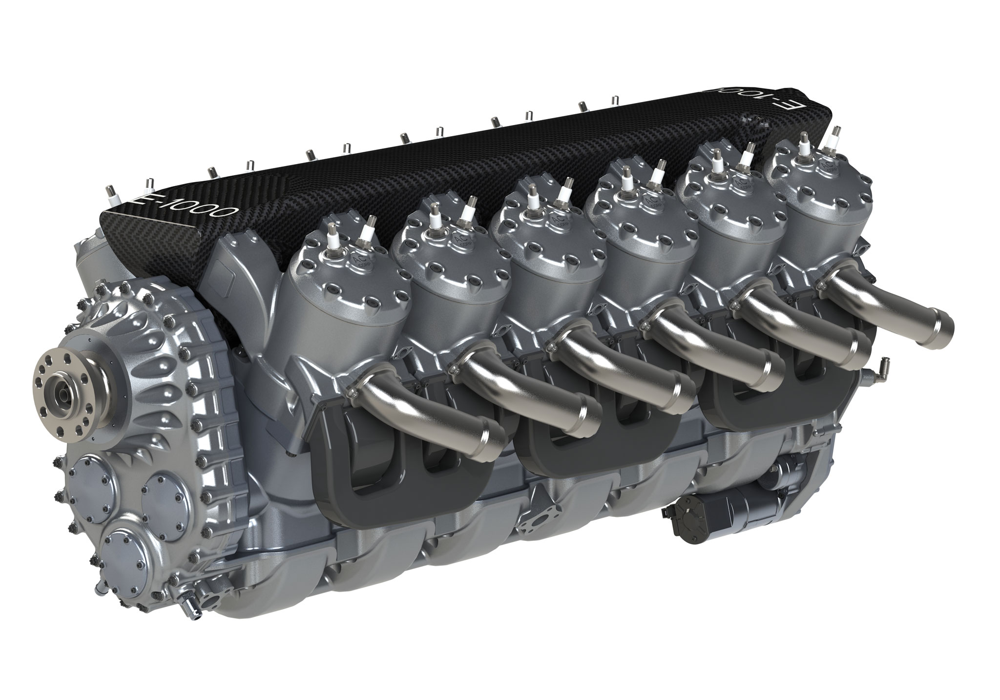

# gearia ⚙️


Planaria instance for contract state updates and event driven storage.

___

### cli

`npm i gearia -g`

```
1. gearia [contractID]
...
```

### npm module

`npm i gearia -S`

```
const { gearia, createServer } = require("gearia")

const getters = {
  getOwner: "string",
  getSupply: "unsigned int",
  getBalances: "map"
}

// 1. run block handler
gearia(contractID, getters, _constructor, startBlock)

// 2. run transaction server
createServer('TxDB')

// 3. run state server
createServer('StateDB')

```

### TODO: Docker

`docker run <onchain-gearia> TX_ID=<contract-txid>`  
___
